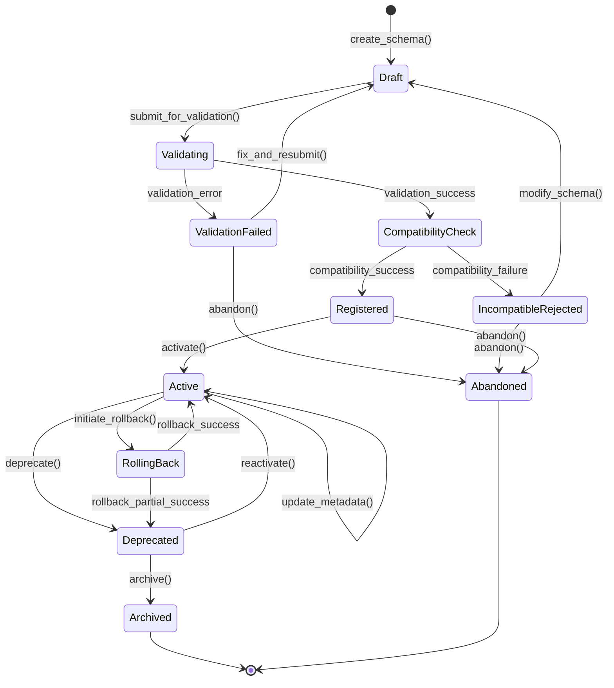

# PSEUDOCODE - LLM Schema Registry

## Table of Contents
1. [Schema Lifecycle State Machine](#schema-lifecycle-state-machine)
2. [Serialization Format Decision Logic](#serialization-format-decision-logic)
3. [Version Numbering Scheme](#version-numbering-scheme)
4. [Core Operation Pseudocode](#core-operation-pseudocode)
5. [Event Stream Design](#event-stream-design)
6. [Data Flow Diagrams](#data-flow-diagrams)

---

## 1. Schema Lifecycle State Machine

### 1.1 State Machine Diagram



### 1.2 State Definitions

```pseudocode
ENUM SchemaState {
    DRAFT,                    // Initial creation, not validated
    VALIDATING,               // In validation pipeline
    VALIDATION_FAILED,        // Failed structural validation
    COMPATIBILITY_CHECK,      // Passed validation, checking compatibility
    INCOMPATIBLE_REJECTED,    // Failed compatibility check
    REGISTERED,               // Passed all checks, stored but not active
    ACTIVE,                   // Currently in use for production
    DEPRECATED,               // Marked for future removal
    ARCHIVED,                 // No longer usable, kept for historical record
    ABANDONED,                // Discarded without registration
    ROLLING_BACK              // In process of reverting to previous version
}

STRUCT StateTransition {
    from_state: SchemaState
    to_state: SchemaState
    trigger: String
    timestamp: DateTime
    actor: String            // User or system that triggered transition
    reason: Optional<String>
    metadata: Map<String, String>
}

STRUCT SchemaLifecycle {
    schema_id: UUID
    current_state: SchemaState
    state_history: List<StateTransition>
    created_at: DateTime
    updated_at: DateTime
    state_locks: Map<String, Lock>  // Prevent concurrent state changes
}
```

### 1.3 Registration Flow Pseudocode

```pseudocode
FUNCTION schema_registration_flow(schema_input: SchemaInput) -> Result<SchemaID, RegistrationError> {
    // Step 1: Create draft schema
    draft_schema = create_draft_schema(schema_input)
    lifecycle = initialize_lifecycle(draft_schema.id, SchemaState.DRAFT)

    // Step 2: Transition to validation
    TRY {
        transition_state(lifecycle, SchemaState.DRAFT, SchemaState.VALIDATING)

        // Step 3: Validate schema structure
        validation_result = validate_schema_structure(draft_schema)

        IF NOT validation_result.is_valid {
            transition_state(lifecycle, SchemaState.VALIDATING, SchemaState.VALIDATION_FAILED)
            record_validation_errors(draft_schema.id, validation_result.errors)
            RETURN Error(ValidationError(validation_result.errors))
        }

        // Step 4: Compatibility check
        transition_state(lifecycle, SchemaState.VALIDATING, SchemaState.COMPATIBILITY_CHECK)

        compatibility_result = check_compatibility(
            new_schema=draft_schema,
            mode=schema_input.compatibility_mode
        )

        IF NOT compatibility_result.is_compatible {
            transition_state(lifecycle, SchemaState.COMPATIBILITY_CHECK, SchemaState.INCOMPATIBLE_REJECTED)
            record_compatibility_errors(draft_schema.id, compatibility_result.errors)
            RETURN Error(CompatibilityError(compatibility_result.errors))
        }

        // Step 5: Register schema
        transition_state(lifecycle, SchemaState.COMPATIBILITY_CHECK, SchemaState.REGISTERED)

        registered_schema = store_schema(draft_schema, validation_result, compatibility_result)
        emit_event(SchemaRegisteredEvent(registered_schema))

        // Step 6: Auto-activate if requested
        IF schema_input.auto_activate {
            transition_state(lifecycle, SchemaState.REGISTERED, SchemaState.ACTIVE)
            emit_event(SchemaActivatedEvent(registered_schema))
        }

        RETURN Success(registered_schema.id)

    } CATCH error {
        rollback_registration(draft_schema.id)
        RETURN Error(error)
    }
}

FUNCTION transition_state(lifecycle: SchemaLifecycle, from: SchemaState, to: SchemaState) -> Result<Void, StateError> {
    // Acquire lock to prevent race conditions
    lock = acquire_state_lock(lifecycle.schema_id)

    TRY {
        // Verify current state matches expected
        IF lifecycle.current_state != from {
            RETURN Error(StateError("Invalid state transition: expected {from}, found {lifecycle.current_state}"))
        }

        // Validate transition is allowed
        IF NOT is_valid_transition(from, to) {
            RETURN Error(StateError("Transition from {from} to {to} not allowed"))
        }

        // Record transition
        transition = StateTransition {
            from_state: from,
            to_state: to,
            trigger: get_current_operation(),
            timestamp: now(),
            actor: get_current_actor(),
            reason: None,
            metadata: empty_map()
        }

        lifecycle.state_history.append(transition)
        lifecycle.current_state = to
        lifecycle.updated_at = now()

        // Persist state change
        persist_lifecycle(lifecycle)

        RETURN Success()

    } FINALLY {
        release_lock(lock)
    }
}
```

### 1.4 Validation Pipeline

```pseudocode
STRUCT ValidationRule {
    name: String
    severity: Enum { ERROR, WARNING, INFO }
    validator: Function(Schema) -> ValidationResult
}

STRUCT ValidationResult {
    is_valid: Boolean
    errors: List<ValidationError>
    warnings: List<ValidationWarning>
    metadata: Map<String, Value>
}

FUNCTION validate_schema_structure(schema: Schema) -> ValidationResult {
    result = ValidationResult {
        is_valid: true,
        errors: [],
        warnings: [],
        metadata: {}
    }

    // Pipeline of validation rules
    validation_rules = [
        structural_validity_check,
        semantic_consistency_check,
        naming_convention_check,
        field_type_safety_check,
        recursion_depth_check,
        schema_size_check,
        llm_specific_validation
    ]

    FOR EACH rule IN validation_rules {
        rule_result = rule.validator(schema)

        result.errors.extend(rule_result.errors)
        result.warnings.extend(rule_result.warnings)
        result.metadata.merge(rule_result.metadata)

        // Fail fast on critical errors
        IF rule.severity == ERROR AND rule_result.errors.is_not_empty() {
            result.is_valid = false
            IF should_fail_fast(rule) {
                BREAK
            }
        }
    }

    // Format-specific validation
    MATCH schema.format {
        JSON_SCHEMA => validate_json_schema_specifics(schema, result),
        AVRO => validate_avro_specifics(schema, result),
        PROTOBUF => validate_protobuf_specifics(schema, result)
    }

    RETURN result
}

FUNCTION llm_specific_validation(schema: Schema) -> ValidationResult {
    // Validate LLM-specific constraints
    result = ValidationResult.new()

    // Check for LLM-friendly field naming
    FOR EACH field IN schema.fields {
        IF NOT is_llm_friendly_name(field.name) {
            result.warnings.append(
                Warning("Field '{field.name}' may be ambiguous for LLM interpretation")
            )
        }

        // Check for description/documentation
        IF field.description.is_empty() {
            result.warnings.append(
                Warning("Field '{field.name}' lacks description for LLM context")
            )
        }

        // Check for example values
        IF field.examples.is_empty() {
            result.warnings.append(
                Warning("Field '{field.name}' lacks examples for LLM guidance")
            )
        }
    }

    // Validate schema has sufficient context
    IF schema.description.is_empty() {
        result.errors.append(
            Error("Schema must have description for LLM understanding")
        )
    }

    // Check for semantic tags
    IF schema.semantic_tags.is_empty() {
        result.warnings.append(
            Warning("Schema lacks semantic tags for LLM categorization")
        )
    }

    RETURN result
}
```

### 1.5 Compatibility Checking Algorithm

```pseudocode
ENUM CompatibilityMode {
    BACKWARD,           // New schema can read old data
    FORWARD,            // Old schema can read new data
    FULL,               // Both backward and forward
    NONE,               // No compatibility required
    BACKWARD_TRANSITIVE,  // Backward with all previous versions
    FORWARD_TRANSITIVE,   // Forward with all previous versions
    FULL_TRANSITIVE       // Full with all previous versions
}

STRUCT CompatibilityResult {
    is_compatible: Boolean
    mode: CompatibilityMode
    violations: List<CompatibilityViolation>
    checked_versions: List<SchemaVersion>
}

STRUCT CompatibilityViolation {
    type: Enum { FIELD_REMOVED, TYPE_CHANGED, CONSTRAINT_ADDED, REQUIRED_ADDED }
    field_path: String
    old_value: Value
    new_value: Value
    severity: Enum { BREAKING, WARNING }
    description: String
}

FUNCTION check_compatibility(new_schema: Schema, mode: CompatibilityMode) -> CompatibilityResult {
    result = CompatibilityResult {
        is_compatible: true,
        mode: mode,
        violations: [],
        checked_versions: []
    }

    // Get versions to check based on mode
    versions_to_check = get_versions_for_compatibility_check(new_schema, mode)

    IF versions_to_check.is_empty() {
        // First version, automatically compatible
        RETURN result
    }

    FOR EACH old_version IN versions_to_check {
        result.checked_versions.append(old_version)

        MATCH mode {
            BACKWARD | BACKWARD_TRANSITIVE => {
                violations = check_backward_compatibility(new_schema, old_version)
                result.violations.extend(violations)
            },
            FORWARD | FORWARD_TRANSITIVE => {
                violations = check_forward_compatibility(new_schema, old_version)
                result.violations.extend(violations)
            },
            FULL | FULL_TRANSITIVE => {
                backward_violations = check_backward_compatibility(new_schema, old_version)
                forward_violations = check_forward_compatibility(new_schema, old_version)
                result.violations.extend(backward_violations)
                result.violations.extend(forward_violations)
            },
            NONE => {
                // Skip compatibility check
                CONTINUE
            }
        }

        // Break early if not transitive mode
        IF NOT is_transitive_mode(mode) {
            BREAK
        }
    }

    // Filter breaking violations
    breaking_violations = result.violations.filter(v => v.severity == BREAKING)
    result.is_compatible = breaking_violations.is_empty()

    RETURN result
}

FUNCTION check_backward_compatibility(new_schema: Schema, old_schema: Schema) -> List<CompatibilityViolation> {
    violations = []

    // Rule 1: Cannot remove fields without default values
    FOR EACH old_field IN old_schema.fields {
        IF NOT new_schema.has_field(old_field.name) {
            IF NOT old_field.has_default {
                violations.append(CompatibilityViolation {
                    type: FIELD_REMOVED,
                    field_path: old_field.name,
                    old_value: old_field,
                    new_value: null,
                    severity: BREAKING,
                    description: "Field '{old_field.name}' removed without default value"
                })
            }
        }
    }

    // Rule 2: Cannot change field types incompatibly
    FOR EACH new_field IN new_schema.fields {
        IF old_schema.has_field(new_field.name) {
            old_field = old_schema.get_field(new_field.name)

            IF NOT are_types_compatible(new_field.type, old_field.type) {
                violations.append(CompatibilityViolation {
                    type: TYPE_CHANGED,
                    field_path: new_field.name,
                    old_value: old_field.type,
                    new_value: new_field.type,
                    severity: BREAKING,
                    description: "Type changed from {old_field.type} to {new_field.type}"
                })
            }
        }
    }

    // Rule 3: Cannot add new required fields without defaults
    FOR EACH new_field IN new_schema.fields {
        IF NOT old_schema.has_field(new_field.name) {
            IF new_field.is_required AND NOT new_field.has_default {
                violations.append(CompatibilityViolation {
                    type: REQUIRED_ADDED,
                    field_path: new_field.name,
                    old_value: null,
                    new_value: new_field,
                    severity: BREAKING,
                    description: "New required field '{new_field.name}' added without default"
                })
            }
        }
    }

    // Rule 4: Cannot tighten constraints
    FOR EACH new_field IN new_schema.fields {
        IF old_schema.has_field(new_field.name) {
            old_field = old_schema.get_field(new_field.name)

            IF is_constraint_tightened(new_field.constraints, old_field.constraints) {
                violations.append(CompatibilityViolation {
                    type: CONSTRAINT_ADDED,
                    field_path: new_field.name,
                    old_value: old_field.constraints,
                    new_value: new_field.constraints,
                    severity: BREAKING,
                    description: "Constraints tightened on field '{new_field.name}'"
                })
            }
        }
    }

    RETURN violations
}

FUNCTION check_forward_compatibility(new_schema: Schema, old_schema: Schema) -> List<CompatibilityViolation> {
    // Forward compatibility is the inverse of backward
    // Old schema must be able to read data written with new schema
    RETURN check_backward_compatibility(old_schema, new_schema)
}

FUNCTION are_types_compatible(new_type: Type, old_type: Type) -> Boolean {
    // Exact match
    IF new_type == old_type {
        RETURN true
    }

    // Type widening allowed (e.g., int32 -> int64)
    type_widening_matrix = {
        (INT32, INT64): true,
        (FLOAT, DOUBLE): true,
        (STRING, TEXT): true,
        // ... more widening rules
    }

    IF type_widening_matrix.contains((old_type, new_type)) {
        RETURN type_widening_matrix[(old_type, new_type)]
    }

    // Union types: new must be subset of old
    IF new_type.is_union() AND old_type.is_union() {
        RETURN new_type.variants.is_subset_of(old_type.variants)
    }

    // Array/List: element types must be compatible
    IF new_type.is_array() AND old_type.is_array() {
        RETURN are_types_compatible(new_type.element_type, old_type.element_type)
    }

    // Map: key and value types must be compatible
    IF new_type.is_map() AND old_type.is_map() {
        RETURN are_types_compatible(new_type.key_type, old_type.key_type) AND
               are_types_compatible(new_type.value_type, old_type.value_type)
    }

    RETURN false
}
```

### 1.6 Deprecation Workflow

```pseudocode
STRUCT DeprecationRequest {
    schema_id: UUID
    version: SemanticVersion
    reason: String
    deprecation_date: DateTime
    sunset_date: DateTime          // When schema will be archived
    migration_guide: Optional<String>
    replacement_schema: Optional<SchemaReference>
}

FUNCTION deprecate_schema(request: DeprecationRequest) -> Result<Void, DeprecationError> {
    // Acquire lock on schema
    lock = acquire_schema_lock(request.schema_id, request.version)

    TRY {
        schema = load_schema(request.schema_id, request.version)
        lifecycle = load_lifecycle(request.schema_id)

        // Validate current state allows deprecation
        IF lifecycle.current_state != SchemaState.ACTIVE {
            RETURN Error(DeprecationError("Can only deprecate ACTIVE schemas"))
        }

        // Validate sunset date is in future
        IF request.sunset_date <= now() {
            RETURN Error(DeprecationError("Sunset date must be in the future"))
        }

        // Check for dependent schemas
        dependents = find_dependent_schemas(schema.id, schema.version)
        IF dependents.is_not_empty() {
            emit_warning(DependentSchemasWarning(schema, dependents))
        }

        // Transition to deprecated state
        transition_state(lifecycle, SchemaState.ACTIVE, SchemaState.DEPRECATED)

        // Store deprecation metadata
        deprecation_info = DeprecationInfo {
            reason: request.reason,
            deprecated_at: now(),
            deprecated_by: get_current_actor(),
            sunset_date: request.sunset_date,
            migration_guide: request.migration_guide,
            replacement_schema: request.replacement_schema
        }

        schema.metadata.deprecation = deprecation_info
        persist_schema(schema)

        // Schedule sunset task
        schedule_sunset(schema.id, schema.version, request.sunset_date)

        // Emit deprecation event
        emit_event(SchemaDeprecatedEvent {
            schema_id: schema.id,
            version: schema.version,
            deprecation_info: deprecation_info,
            dependents: dependents
        })

        // Notify stakeholders
        notify_schema_stakeholders(schema, DeprecationNotification(deprecation_info))

        RETURN Success()

    } FINALLY {
        release_lock(lock)
    }
}

FUNCTION sunset_schema(schema_id: UUID, version: SemanticVersion) -> Result<Void, Error> {
    // Triggered automatically at sunset_date
    lock = acquire_schema_lock(schema_id, version)

    TRY {
        schema = load_schema(schema_id, version)
        lifecycle = load_lifecycle(schema_id)

        IF lifecycle.current_state != SchemaState.DEPRECATED {
            RETURN Error("Can only sunset DEPRECATED schemas")
        }

        // Check if still in use
        usage_stats = get_schema_usage_stats(schema_id, version)
        IF usage_stats.active_consumers > 0 {
            // Delay sunset and notify
            emit_event(SunsetDelayedEvent(schema, usage_stats))
            reschedule_sunset(schema_id, version, calculate_new_sunset_date())
            RETURN Success()
        }

        // Archive schema
        transition_state(lifecycle, SchemaState.DEPRECATED, SchemaState.ARCHIVED)

        // Move to cold storage
        archive_schema_data(schema)

        emit_event(SchemaArchivedEvent(schema))

        RETURN Success()

    } FINALLY {
        release_lock(lock)
    }
}
```

### 1.7 Rollback Mechanism

```pseudocode
STRUCT RollbackRequest {
    schema_id: UUID
    current_version: SemanticVersion
    target_version: SemanticVersion
    reason: String
    force: Boolean  // Override safety checks
}

STRUCT RollbackPlan {
    schema_id: UUID
    from_version: SemanticVersion
    to_version: SemanticVersion
    affected_consumers: List<Consumer>
    compatibility_issues: List<CompatibilityViolation>
    rollback_steps: List<RollbackStep>
    estimated_duration: Duration
}

FUNCTION initiate_rollback(request: RollbackRequest) -> Result<RollbackPlan, RollbackError> {
    // Step 1: Validate rollback request
    validation = validate_rollback_request(request)
    IF NOT validation.is_valid {
        RETURN Error(RollbackError(validation.errors))
    }

    // Step 2: Create rollback plan
    plan = create_rollback_plan(request)

    // Step 3: Check safety constraints
    IF NOT request.force {
        safety_check = verify_rollback_safety(plan)
        IF NOT safety_check.is_safe {
            RETURN Error(RollbackError("Unsafe rollback: {safety_check.reasons}"))
        }
    }

    // Step 4: Transition to rolling back state
    lifecycle = load_lifecycle(request.schema_id)
    transition_state(lifecycle, lifecycle.current_state, SchemaState.ROLLING_BACK)

    // Step 5: Execute rollback
    TRY {
        execute_rollback_plan(plan)

        // Step 6: Verify rollback success
        verification = verify_rollback_completion(plan)

        IF verification.is_successful {
            transition_state(lifecycle, SchemaState.ROLLING_BACK, SchemaState.ACTIVE)
            emit_event(RollbackSuccessEvent(plan))
            RETURN Success(plan)
        } ELSE {
            transition_state(lifecycle, SchemaState.ROLLING_BACK, SchemaState.DEPRECATED)
            emit_event(RollbackPartialSuccessEvent(plan, verification.issues))
            RETURN Error(RollbackError("Partial rollback: {verification.issues}"))
        }

    } CATCH error {
        transition_state(lifecycle, SchemaState.ROLLING_BACK, lifecycle.previous_state)
        emit_event(RollbackFailedEvent(plan, error))
        RETURN Error(error)
    }
}

FUNCTION create_rollback_plan(request: RollbackRequest) -> RollbackPlan {
    current_schema = load_schema(request.schema_id, request.current_version)
    target_schema = load_schema(request.schema_id, request.target_version)

    // Identify affected consumers
    consumers = find_consumers(request.schema_id, request.current_version)

    // Check compatibility of rollback
    compatibility = check_compatibility_between_versions(
        target_schema,
        current_schema,
        CompatibilityMode.BACKWARD
    )

    // Create step-by-step rollback plan
    steps = [
        RollbackStep("Notify consumers", notify_consumers_of_rollback),
        RollbackStep("Disable current version", disable_schema_version),
        RollbackStep("Activate target version", activate_target_version),
        RollbackStep("Update routing", update_version_routing),
        RollbackStep("Verify consumer health", verify_consumer_health),
        RollbackStep("Update metadata", update_rollback_metadata)
    ]

    plan = RollbackPlan {
        schema_id: request.schema_id,
        from_version: request.current_version,
        to_version: request.target_version,
        affected_consumers: consumers,
        compatibility_issues: compatibility.violations,
        rollback_steps: steps,
        estimated_duration: calculate_rollback_duration(steps, consumers.length)
    }

    RETURN plan
}

FUNCTION execute_rollback_plan(plan: RollbackPlan) -> Result<Void, Error> {
    rollback_context = RollbackContext {
        plan: plan,
        start_time: now(),
        completed_steps: [],
        failed_steps: []
    }

    FOR EACH step IN plan.rollback_steps {
        emit_event(RollbackStepStarted(step.name))

        TRY {
            step.execute(plan)
            rollback_context.completed_steps.append(step)
            emit_event(RollbackStepCompleted(step.name))

        } CATCH error {
            rollback_context.failed_steps.append((step, error))
            emit_event(RollbackStepFailed(step.name, error))

            // Attempt to undo completed steps
            undo_rollback_steps(rollback_context.completed_steps)

            RETURN Error(error)
        }
    }

    RETURN Success()
}
```

---

## 2. Serialization Format Decision Logic

```pseudocode
ENUM SerializationFormat {
    JSON_SCHEMA,
    AVRO,
    PROTOBUF
}

STRUCT FormatCapabilities {
    supports_evolution: Boolean
    supports_validation: Boolean
    supports_codegen: Boolean
    binary_efficient: Boolean
    human_readable: Boolean
    ecosystem_maturity: Float  // 0.0 to 1.0
    llm_friendly: Float        // 0.0 to 1.0
}

FUNCTION select_serialization_format(requirements: SchemaRequirements) -> SerializationFormat {
    // Decision matrix based on requirements

    // Priority 1: LLM friendliness
    IF requirements.primary_use_case == LLM_INTERACTION {
        IF requirements.needs_human_readability {
            RETURN JSON_SCHEMA  // Most human/LLM readable
        }
    }

    // Priority 2: Performance
    IF requirements.performance_critical {
        IF requirements.message_size_constraint == STRICT {
            RETURN PROTOBUF  // Most compact binary format
        }
        IF requirements.schema_evolution == COMPLEX {
            RETURN AVRO  // Best schema evolution with compact binary
        }
    }

    // Priority 3: Ecosystem integration
    IF requirements.target_ecosystem == JVM {
        RETURN AVRO  // Strong JVM support
    }
    IF requirements.target_ecosystem == GRPC {
        RETURN PROTOBUF  // Native gRPC support
    }
    IF requirements.target_ecosystem == WEB {
        RETURN JSON_SCHEMA  // Native web support
    }

    // Priority 4: Validation complexity
    IF requirements.complex_validation_rules {
        RETURN JSON_SCHEMA  // Most expressive validation
    }

    // Priority 5: Code generation
    IF requirements.needs_type_safety AND requirements.static_languages {
        RETURN PROTOBUF  // Best codegen for static languages
    }

    // Default: JSON Schema for LLM use cases
    RETURN JSON_SCHEMA
}

FUNCTION convert_schema_format(schema: Schema, target_format: SerializationFormat) -> Result<Schema, ConversionError> {
    source_format = schema.format

    IF source_format == target_format {
        RETURN Success(schema)
    }

    // Build conversion graph
    MATCH (source_format, target_format) {
        (JSON_SCHEMA, AVRO) => convert_jsonschema_to_avro(schema),
        (JSON_SCHEMA, PROTOBUF) => convert_jsonschema_to_protobuf(schema),
        (AVRO, JSON_SCHEMA) => convert_avro_to_jsonschema(schema),
        (AVRO, PROTOBUF) => convert_avro_to_protobuf(schema),
        (PROTOBUF, JSON_SCHEMA) => convert_protobuf_to_jsonschema(schema),
        (PROTOBUF, AVRO) => convert_protobuf_to_avro(schema),
        _ => Error(ConversionError("Unsupported conversion path"))
    }
}

FUNCTION convert_jsonschema_to_avro(json_schema: Schema) -> Result<Schema, ConversionError> {
    avro_schema = AvroSchema.new()

    // Map basic metadata
    avro_schema.name = json_schema.name
    avro_schema.namespace = json_schema.namespace
    avro_schema.doc = json_schema.description

    // Convert fields
    FOR EACH json_field IN json_schema.properties {
        avro_field = map_json_type_to_avro(json_field)

        // Handle optionality
        IF NOT json_field.is_required {
            avro_field.type = union([null, avro_field.type])
            avro_field.default = null
        }

        avro_schema.fields.append(avro_field)
    }

    // Validate conversion
    validation = validate_schema_structure(avro_schema)
    IF NOT validation.is_valid {
        RETURN Error(ConversionError(validation.errors))
    }

    RETURN Success(avro_schema)
}

FUNCTION map_json_type_to_avro(json_field: JSONSchemaField) -> AvroField {
    avro_field = AvroField.new()
    avro_field.name = json_field.name
    avro_field.doc = json_field.description

    MATCH json_field.type {
        "string" => {
            IF json_field.format == "date-time" {
                avro_field.type = "long"
                avro_field.logicalType = "timestamp-millis"
            } ELSE IF json_field.format == "uuid" {
                avro_field.type = "string"
                avro_field.logicalType = "uuid"
            } ELSE {
                avro_field.type = "string"
            }
        },
        "integer" => {
            IF json_field.minimum >= -2147483648 AND json_field.maximum <= 2147483647 {
                avro_field.type = "int"
            } ELSE {
                avro_field.type = "long"
            }
        },
        "number" => avro_field.type = "double",
        "boolean" => avro_field.type = "boolean",
        "array" => {
            avro_field.type = {
                type: "array",
                items: map_json_type_to_avro(json_field.items)
            }
        },
        "object" => {
            avro_field.type = convert_jsonschema_to_avro(json_field).unwrap()
        },
        _ => THROW ConversionError("Unsupported type: {json_field.type}")
    }

    RETURN avro_field
}
```

---

## 3. Version Numbering Scheme

### 3.1 Semantic Versioning for Schemas

```pseudocode
STRUCT SemanticVersion {
    major: Integer      // Breaking changes
    minor: Integer      // Backward-compatible additions
    patch: Integer      // Backward-compatible bug fixes
    prerelease: Optional<String>  // e.g., "alpha.1", "beta.2"
    build_metadata: Optional<String>
}

STRUCT VersioningRules {
    auto_increment: Boolean
    allow_prerelease: Boolean
    require_semver: Boolean
    breaking_change_detection: Boolean
}

FUNCTION calculate_next_version(
    current_version: SemanticVersion,
    new_schema: Schema,
    old_schema: Schema,
    rules: VersioningRules
) -> SemanticVersion {

    IF rules.breaking_change_detection {
        // Analyze changes to determine version bump
        changes = analyze_schema_changes(new_schema, old_schema)

        IF changes.has_breaking_changes {
            // Major version bump
            RETURN SemanticVersion {
                major: current_version.major + 1,
                minor: 0,
                patch: 0,
                prerelease: None,
                build_metadata: None
            }
        } ELSE IF changes.has_new_features {
            // Minor version bump
            RETURN SemanticVersion {
                major: current_version.major,
                minor: current_version.minor + 1,
                patch: 0,
                prerelease: None,
                build_metadata: None
            }
        } ELSE {
            // Patch version bump
            RETURN SemanticVersion {
                major: current_version.major,
                minor: current_version.minor,
                patch: current_version.patch + 1,
                prerelease: None,
                build_metadata: None
            }
        }
    } ELSE {
        // Manual versioning - user must specify
        RETURN current_version
    }
}

FUNCTION analyze_schema_changes(new_schema: Schema, old_schema: Schema) -> SchemaChanges {
    changes = SchemaChanges {
        has_breaking_changes: false,
        has_new_features: false,
        changes_list: []
    }

    // Check for breaking changes
    breaking_indicators = [
        field_removed,
        field_type_changed,
        field_made_required,
        constraint_tightened,
        enum_value_removed
    ]

    FOR EACH indicator IN breaking_indicators {
        IF indicator(new_schema, old_schema) {
            changes.has_breaking_changes = true
            changes.changes_list.append(indicator.describe())
        }
    }

    // Check for new features
    feature_indicators = [
        field_added,
        enum_value_added,
        constraint_relaxed
    ]

    FOR EACH indicator IN feature_indicators {
        IF indicator(new_schema, old_schema) {
            changes.has_new_features = true
            changes.changes_list.append(indicator.describe())
        }
    }

    RETURN changes
}

FUNCTION parse_semantic_version(version_string: String) -> Result<SemanticVersion, ParseError> {
    // Parse format: MAJOR.MINOR.PATCH[-PRERELEASE][+BUILD]
    regex = r"^(\d+)\.(\d+)\.(\d+)(?:-([0-9A-Za-z\-\.]+))?(?:\+([0-9A-Za-z\-\.]+))?$"

    match = regex.match(version_string)
    IF match.is_none() {
        RETURN Error(ParseError("Invalid semantic version format"))
    }

    RETURN Success(SemanticVersion {
        major: parse_int(match.group(1)),
        minor: parse_int(match.group(2)),
        patch: parse_int(match.group(3)),
        prerelease: match.group(4),
        build_metadata: match.group(5)
    })
}

FUNCTION compare_versions(v1: SemanticVersion, v2: SemanticVersion) -> Ordering {
    // Compare major
    IF v1.major != v2.major {
        RETURN compare(v1.major, v2.major)
    }

    // Compare minor
    IF v1.minor != v2.minor {
        RETURN compare(v1.minor, v2.minor)
    }

    // Compare patch
    IF v1.patch != v2.patch {
        RETURN compare(v1.patch, v2.patch)
    }

    // Compare prerelease (version without prerelease > version with prerelease)
    IF v1.prerelease.is_some() AND v2.prerelease.is_none() {
        RETURN LESS
    }
    IF v1.prerelease.is_none() AND v2.prerelease.is_some() {
        RETURN GREATER
    }
    IF v1.prerelease.is_some() AND v2.prerelease.is_some() {
        RETURN compare_prerelease(v1.prerelease.unwrap(), v2.prerelease.unwrap())
    }

    // Build metadata ignored in precedence
    RETURN EQUAL
}
```

---

## 4. Core Operation Pseudocode

### 4.1 Schema Register

```pseudocode
STRUCT SchemaInput {
    name: String
    namespace: String
    format: SerializationFormat
    content: String               // Raw schema definition
    description: String
    compatibility_mode: CompatibilityMode
    auto_activate: Boolean
    version: Optional<SemanticVersion>
    metadata: Map<String, Value>
    tags: List<String>
    examples: List<Example>
}

STRUCT RegisteredSchema {
    id: UUID
    name: String
    namespace: String
    version: SemanticVersion
    format: SerializationFormat
    content: String
    content_hash: String          // SHA-256 of content
    description: String
    compatibility_mode: CompatibilityMode
    state: SchemaState
    metadata: SchemaMetadata
    created_at: DateTime
    created_by: String
    tags: List<String>
    examples: List<Example>
}

FUNCTION schema_register(input: SchemaInput) -> Result<RegisteredSchema, RegistrationError> {
    // Step 1: Validate input
    IF input.name.is_empty() OR input.content.is_empty() {
        RETURN Error(RegistrationError("Name and content are required"))
    }

    // Step 2: Parse and normalize schema content
    TRY {
        parsed_schema = parse_schema(input.content, input.format)
        normalized_content = normalize_schema(parsed_schema, input.format)
    } CATCH parse_error {
        RETURN Error(RegistrationError("Schema parse error: {parse_error}"))
    }

    // Step 3: Calculate content hash for deduplication
    content_hash = sha256(normalized_content)

    // Step 4: Check for duplicate schema
    existing = find_schema_by_hash(content_hash, input.namespace)
    IF existing.is_some() {
        RETURN Error(RegistrationError("Identical schema already registered: {existing.id}"))
    }

    // Step 5: Determine version
    version = IF input.version.is_some() {
        input.version.unwrap()
    } ELSE {
        calculate_next_version_for_schema(input.namespace, input.name)
    }

    // Step 6: Create schema object
    schema = RegisteredSchema {
        id: generate_uuid(),
        name: input.name,
        namespace: input.namespace,
        version: version,
        format: input.format,
        content: normalized_content,
        content_hash: content_hash,
        description: input.description,
        compatibility_mode: input.compatibility_mode,
        state: SchemaState.DRAFT,
        metadata: SchemaMetadata {
            created_at: now(),
            created_by: get_current_user(),
            updated_at: now(),
            updated_by: get_current_user(),
            custom: input.metadata
        },
        tags: input.tags,
        examples: input.examples,
        created_at: now(),
        created_by: get_current_user()
    }

    // Step 7: Run through registration flow
    registration_result = schema_registration_flow(schema)

    MATCH registration_result {
        Success(schema_id) => {
            registered = load_schema(schema_id)
            RETURN Success(registered)
        },
        Error(err) => {
            RETURN Error(err)
        }
    }
}

FUNCTION normalize_schema(schema: ParsedSchema, format: SerializationFormat) -> String {
    // Normalize schema for consistent hashing and storage

    MATCH format {
        JSON_SCHEMA => {
            // Sort keys alphabetically
            sorted_schema = sort_json_keys(schema)
            // Remove formatting whitespace
            canonical_json = to_canonical_json(sorted_schema)
            RETURN canonical_json
        },
        AVRO => {
            // Avro has canonical form specification
            RETURN to_avro_canonical_form(schema)
        },
        PROTOBUF => {
            // Normalize protobuf by sorting and formatting
            RETURN to_protobuf_canonical_form(schema)
        }
    }
}
```

### 4.2 Schema Validate

```pseudocode
STRUCT ValidationRequest {
    schema: Schema
    rules: List<ValidationRule>
    fail_fast: Boolean
    include_warnings: Boolean
}

STRUCT ValidationReport {
    is_valid: Boolean
    errors: List<ValidationError>
    warnings: List<ValidationWarning>
    info: List<ValidationInfo>
    validation_time: Duration
    rules_applied: List<String>
}

FUNCTION schema_validate(request: ValidationRequest) -> ValidationReport {
    report = ValidationReport {
        is_valid: true,
        errors: [],
        warnings: [],
        info: [],
        validation_time: Duration.zero(),
        rules_applied: []
    }

    start_time = now()

    // Apply each validation rule
    FOR EACH rule IN request.rules {
        report.rules_applied.append(rule.name)

        TRY {
            rule_result = rule.validator(request.schema)

            report.errors.extend(rule_result.errors)
            report.warnings.extend(rule_result.warnings)
            report.info.extend(rule_result.info)

            IF rule_result.errors.is_not_empty() {
                report.is_valid = false

                IF request.fail_fast {
                    BREAK
                }
            }

        } CATCH error {
            report.errors.append(ValidationError {
                rule: rule.name,
                message: "Rule execution failed: {error}",
                severity: ERROR
            })
            report.is_valid = false

            IF request.fail_fast {
                BREAK
            }
        }
    }

    report.validation_time = now() - start_time

    // Filter warnings if not requested
    IF NOT request.include_warnings {
        report.warnings = []
        report.info = []
    }

    RETURN report
}

// Built-in validation rules
FUNCTION structural_validity_check(schema: Schema) -> ValidationResult {
    result = ValidationResult.new()

    MATCH schema.format {
        JSON_SCHEMA => {
            // Validate against JSON Schema meta-schema
            meta_schema = load_json_schema_metaschema(schema.schema_version)
            validation = validate_against_metaschema(schema, meta_schema)

            IF NOT validation.is_valid {
                result.errors.extend(validation.errors)
            }
        },
        AVRO => {
            // Validate Avro schema structure
            TRY {
                avro_schema = parse_avro_schema(schema.content)
                validate_avro_names(avro_schema, result)
                validate_avro_types(avro_schema, result)
            } CATCH error {
                result.errors.append(Error("Invalid Avro schema: {error}"))
            }
        },
        PROTOBUF => {
            // Validate protobuf syntax
            TRY {
                proto_schema = parse_protobuf_schema(schema.content)
                validate_protobuf_syntax(proto_schema, result)
                validate_field_numbers(proto_schema, result)
            } CATCH error {
                result.errors.append(Error("Invalid Protobuf schema: {error}"))
            }
        }
    }

    RETURN result
}

FUNCTION naming_convention_check(schema: Schema) -> ValidationResult {
    result = ValidationResult.new()

    // Check schema name follows convention
    IF NOT matches_pattern(schema.name, r"^[A-Z][a-zA-Z0-9]*$") {
        result.warnings.append(
            Warning("Schema name '{schema.name}' should be PascalCase")
        )
    }

    // Check field names
    FOR EACH field IN schema.fields {
        IF NOT matches_pattern(field.name, r"^[a-z][a-zA-Z0-9_]*$") {
            result.warnings.append(
                Warning("Field name '{field.name}' should be camelCase or snake_case")
            )
        }

        // Avoid reserved keywords
        reserved_keywords = ["type", "schema", "class", "interface", "enum"]
        IF reserved_keywords.contains(field.name.lowercase()) {
            result.errors.append(
                Error("Field name '{field.name}' is a reserved keyword")
            )
        }
    }

    RETURN result
}
```

### 4.3 Compatibility Check

```pseudocode
STRUCT CompatibilityCheckRequest {
    new_schema: Schema
    old_schema: Optional<Schema>  // If None, check against latest version
    mode: CompatibilityMode
    transitive: Boolean
}

FUNCTION compatibility_check(
    new_schema: Schema,
    old_schema: Schema,
    mode: CompatibilityMode
) -> CompatibilityResult {

    // Fast path: identical schemas
    IF new_schema.content_hash == old_schema.content_hash {
        RETURN CompatibilityResult {
            is_compatible: true,
            mode: mode,
            violations: [],
            checked_versions: [old_schema.version]
        }
    }

    // Parse schemas for structural comparison
    new_parsed = parse_schema(new_schema.content, new_schema.format)
    old_parsed = parse_schema(old_schema.content, old_schema.format)

    // Format compatibility check
    IF new_schema.format != old_schema.format {
        RETURN CompatibilityResult {
            is_compatible: false,
            mode: mode,
            violations: [
                CompatibilityViolation {
                    type: FORMAT_CHANGED,
                    field_path: "schema.format",
                    old_value: old_schema.format,
                    new_value: new_schema.format,
                    severity: BREAKING,
                    description: "Schema format changed from {old_schema.format} to {new_schema.format}"
                }
            ],
            checked_versions: [old_schema.version]
        }
    }

    // Delegate to mode-specific checker
    MATCH mode {
        BACKWARD => RETURN check_backward_compatibility(new_parsed, old_parsed),
        FORWARD => RETURN check_forward_compatibility(new_parsed, old_parsed),
        FULL => {
            backward = check_backward_compatibility(new_parsed, old_parsed)
            forward = check_forward_compatibility(new_parsed, old_parsed)

            RETURN CompatibilityResult {
                is_compatible: backward.is_compatible AND forward.is_compatible,
                mode: FULL,
                violations: backward.violations.extend(forward.violations),
                checked_versions: [old_schema.version]
            }
        },
        NONE => {
            RETURN CompatibilityResult {
                is_compatible: true,
                mode: NONE,
                violations: [],
                checked_versions: []
            }
        },
        _ => RETURN check_transitive_compatibility(new_schema, old_schema, mode)
    }
}
```

### 4.4 Schema Retrieve

```pseudocode
STRUCT SchemaQuery {
    id: Optional<UUID>
    namespace: Optional<String>
    name: Optional<String>
    version: Optional<SemanticVersion>
    version_range: Optional<VersionRange>
    tags: List<String>
    state: Optional<SchemaState>
    content_hash: Optional<String>
}

STRUCT SchemaQueryResult {
    schemas: List<RegisteredSchema>
    total_count: Integer
    page: Integer
    page_size: Integer
}

FUNCTION schema_retrieve(query: SchemaQuery, page: Integer, page_size: Integer) -> Result<SchemaQueryResult, QueryError> {

    // Build query from parameters
    sql_query = build_schema_query(query)

    // Execute query with pagination
    TRY {
        results = execute_query(sql_query, page, page_size)
        total_count = execute_count_query(sql_query)

        // Load full schema objects
        schemas = []
        FOR EACH row IN results {
            schema = hydrate_schema_from_row(row)
            schemas.append(schema)
        }

        RETURN Success(SchemaQueryResult {
            schemas: schemas,
            total_count: total_count,
            page: page,
            page_size: page_size
        })

    } CATCH error {
        RETURN Error(QueryError("Query execution failed: {error}"))
    }
}

FUNCTION schema_retrieve_by_id(id: UUID, version: Optional<SemanticVersion>) -> Result<RegisteredSchema, NotFoundError> {

    schema = IF version.is_some() {
        // Retrieve specific version
        load_schema_version(id, version.unwrap())
    } ELSE {
        // Retrieve latest active version
        load_latest_schema_version(id, SchemaState.ACTIVE)
    }

    IF schema.is_none() {
        RETURN Error(NotFoundError("Schema not found: {id}"))
    }

    RETURN Success(schema.unwrap())
}

FUNCTION schema_retrieve_by_hash(content_hash: String) -> Result<RegisteredSchema, NotFoundError> {
    // Fast lookup by content hash for deduplication

    schema = query_schema_by_hash(content_hash)

    IF schema.is_none() {
        RETURN Error(NotFoundError("Schema with hash {content_hash} not found"))
    }

    RETURN Success(schema.unwrap())
}

FUNCTION schema_search_semantic(query: String, limit: Integer) -> List<RegisteredSchema> {
    // Semantic search using LLM embeddings

    // Generate embedding for query
    query_embedding = generate_embedding(query)

    // Vector similarity search
    similar_schemas = vector_search(
        collection="schema_embeddings",
        query_vector=query_embedding,
        limit=limit,
        filters={state: ACTIVE}
    )

    // Load full schema objects
    results = []
    FOR EACH match IN similar_schemas {
        schema = load_schema(match.schema_id)
        schema.similarity_score = match.score
        results.append(schema)
    }

    RETURN results
}
```

### 4.5 Schema Deprecate

```pseudocode
FUNCTION schema_deprecate(
    id: UUID,
    version: SemanticVersion,
    reason: String,
    sunset_date: Optional<DateTime>,
    replacement: Optional<SchemaReference>
) -> Result<Void, DeprecationError> {

    request = DeprecationRequest {
        schema_id: id,
        version: version,
        reason: reason,
        deprecation_date: now(),
        sunset_date: sunset_date.unwrap_or(now() + days(90)),  // Default 90 days
        migration_guide: None,
        replacement_schema: replacement
    }

    RETURN deprecate_schema(request)
}

FUNCTION schema_force_delete(id: UUID, version: SemanticVersion, reason: String) -> Result<Void, DeleteError> {
    // Dangerous operation - should require special permissions

    lock = acquire_schema_lock(id, version)

    TRY {
        schema = load_schema(id, version)

        // Check for dependencies
        dependents = find_dependent_schemas(id, version)
        IF dependents.is_not_empty() {
            RETURN Error(DeleteError("Cannot delete schema with dependents: {dependents}"))
        }

        // Check for active consumers
        consumers = find_active_consumers(id, version)
        IF consumers.is_not_empty() {
            RETURN Error(DeleteError("Cannot delete schema with active consumers: {consumers}"))
        }

        // Record deletion in audit log
        audit_log(DeletionEvent {
            schema_id: id,
            version: version,
            reason: reason,
            deleted_by: get_current_user(),
            deleted_at: now()
        })

        // Soft delete - mark as deleted but keep data
        schema.state = SchemaState.DELETED
        schema.metadata.deleted_at = now()
        schema.metadata.deletion_reason = reason

        persist_schema(schema)

        emit_event(SchemaDeletedEvent(schema))

        RETURN Success()

    } FINALLY {
        release_lock(lock)
    }
}
```

---

## 5. Event Stream Design

### 5.1 Event Types

```pseudocode
ENUM EventType {
    SCHEMA_CREATED,
    SCHEMA_VALIDATED,
    SCHEMA_REGISTERED,
    SCHEMA_ACTIVATED,
    SCHEMA_DEPRECATED,
    SCHEMA_ARCHIVED,
    SCHEMA_DELETED,
    SCHEMA_ROLLED_BACK,
    COMPATIBILITY_CHECK_FAILED,
    VALIDATION_FAILED,
    CONSUMER_REGISTERED,
    CONSUMER_UNREGISTERED,
    USAGE_THRESHOLD_EXCEEDED
}

STRUCT SchemaEvent {
    event_id: UUID
    event_type: EventType
    schema_id: UUID
    schema_version: SemanticVersion
    timestamp: DateTime
    actor: String                    // User or system that triggered event
    correlation_id: UUID             // For tracing related events
    payload: EventPayload
    metadata: Map<String, Value>
}

STRUCT EventPayload {
    // Event-specific data
    data: Map<String, Value>
}

// Specific event payloads
STRUCT SchemaRegisteredEvent {
    schema: RegisteredSchema
    validation_result: ValidationResult
    compatibility_result: CompatibilityResult
}

STRUCT SchemaDeprecatedEvent {
    schema_id: UUID
    version: SemanticVersion
    deprecation_info: DeprecationInfo
    dependents: List<SchemaReference>
}

STRUCT CompatibilityCheckFailedEvent {
    schema_id: UUID
    attempted_version: SemanticVersion
    previous_version: SemanticVersion
    violations: List<CompatibilityViolation>
    mode: CompatibilityMode
}

STRUCT ConsumerRegisteredEvent {
    consumer_id: UUID
    consumer_name: String
    schema_id: UUID
    schema_version: SemanticVersion
    subscription_type: Enum { PRODUCER, CONSUMER, BOTH }
}
```

### 5.2 Event Publishing

```pseudocode
INTERFACE EventPublisher {
    publish(event: SchemaEvent) -> Result<Void, PublishError>
    publish_batch(events: List<SchemaEvent>) -> Result<Void, PublishError>
}

STRUCT KafkaEventPublisher implements EventPublisher {
    topic_prefix: String
    producer: KafkaProducer
    serializer: EventSerializer
}

FUNCTION publish_event(event: SchemaEvent) -> Result<Void, PublishError> {
    // Determine topic based on event type
    topic = calculate_topic(event.event_type)

    // Serialize event
    TRY {
        serialized = serialize_event(event)
    } CATCH error {
        RETURN Error(PublishError("Serialization failed: {error}"))
    }

    // Publish to event stream
    TRY {
        event_publisher.publish_to_topic(
            topic=topic,
            key=event.schema_id.to_string(),
            value=serialized,
            headers={
                "event_type": event.event_type.to_string(),
                "schema_version": event.schema_version.to_string(),
                "timestamp": event.timestamp.to_iso8601(),
                "correlation_id": event.correlation_id.to_string()
            }
        )

        // Store event in event log
        store_event_in_log(event)

        RETURN Success()

    } CATCH error {
        // Retry logic
        retry_count = 0
        max_retries = 3

        WHILE retry_count < max_retries {
            wait(exponential_backoff(retry_count))

            TRY {
                event_publisher.publish_to_topic(topic, key, value, headers)
                RETURN Success()
            } CATCH retry_error {
                retry_count += 1
            }
        }

        // Failed after retries - store in dead letter queue
        store_in_dead_letter_queue(event, error)
        RETURN Error(PublishError("Failed to publish after {max_retries} retries: {error}"))
    }
}

FUNCTION calculate_topic(event_type: EventType) -> String {
    // Topic naming: schema-registry.{category}.{event_type}

    MATCH event_type {
        SCHEMA_CREATED | SCHEMA_VALIDATED | SCHEMA_REGISTERED | SCHEMA_ACTIVATED => {
            RETURN "schema-registry.lifecycle.schema-registered"
        },
        SCHEMA_DEPRECATED | SCHEMA_ARCHIVED | SCHEMA_DELETED => {
            RETURN "schema-registry.lifecycle.schema-deprecated"
        },
        COMPATIBILITY_CHECK_FAILED | VALIDATION_FAILED => {
            RETURN "schema-registry.errors.validation"
        },
        CONSUMER_REGISTERED | CONSUMER_UNREGISTERED => {
            RETURN "schema-registry.consumers.registration"
        },
        SCHEMA_ROLLED_BACK => {
            RETURN "schema-registry.operations.rollback"
        },
        _ => {
            RETURN "schema-registry.events.general"
        }
    }
}
```

### 5.3 Event Subscription and Notifications

```pseudocode
STRUCT EventSubscription {
    subscription_id: UUID
    subscriber_id: String           // Service or user ID
    event_types: List<EventType>    // Which events to receive
    filters: Map<String, Value>     // Additional filtering criteria
    delivery_method: DeliveryMethod
    active: Boolean
}

ENUM DeliveryMethod {
    WEBHOOK,
    EMAIL,
    SLACK,
    KAFKA_CONSUMER_GROUP,
    WEBSOCKET
}

STRUCT WebhookDelivery {
    url: String
    http_method: String
    headers: Map<String, String>
    retry_policy: RetryPolicy
    authentication: AuthConfig
}

FUNCTION subscribe_to_events(subscription: EventSubscription) -> Result<UUID, SubscriptionError> {
    // Validate subscription
    IF subscription.event_types.is_empty() {
        RETURN Error(SubscriptionError("Must specify at least one event type"))
    }

    // Validate delivery method configuration
    validation = validate_delivery_method(subscription.delivery_method)
    IF NOT validation.is_valid {
        RETURN Error(SubscriptionError(validation.errors))
    }

    // Store subscription
    subscription.subscription_id = generate_uuid()
    subscription.active = true

    persist_subscription(subscription)

    // Register with event dispatcher
    event_dispatcher.register_subscription(subscription)

    emit_event(SubscriptionCreatedEvent(subscription))

    RETURN Success(subscription.subscription_id)
}

FUNCTION dispatch_event_to_subscribers(event: SchemaEvent) -> Void {
    // Find matching subscriptions
    subscriptions = find_matching_subscriptions(event)

    FOR EACH subscription IN subscriptions {
        IF NOT subscription.active {
            CONTINUE
        }

        // Check filters
        IF NOT matches_filters(event, subscription.filters) {
            CONTINUE
        }

        // Deliver event asynchronously
        spawn_async {
            deliver_event(event, subscription)
        }
    }
}

FUNCTION deliver_event(event: SchemaEvent, subscription: EventSubscription) -> Result<Void, DeliveryError> {
    MATCH subscription.delivery_method {
        WEBHOOK => deliver_via_webhook(event, subscription.webhook_config),
        EMAIL => deliver_via_email(event, subscription.email_config),
        SLACK => deliver_via_slack(event, subscription.slack_config),
        WEBSOCKET => deliver_via_websocket(event, subscription.websocket_config),
        KAFKA_CONSUMER_GROUP => {
            // Already delivered via Kafka topic
            RETURN Success()
        }
    }
}

FUNCTION deliver_via_webhook(event: SchemaEvent, config: WebhookDelivery) -> Result<Void, DeliveryError> {
    // Serialize event
    payload = serialize_event_for_webhook(event)

    // Add signature for verification
    signature = generate_webhook_signature(payload, config.secret)

    // Make HTTP request
    TRY {
        response = http_client.request(
            method=config.http_method,
            url=config.url,
            headers={
                "Content-Type": "application/json",
                "X-Schema-Registry-Event": event.event_type.to_string(),
                "X-Schema-Registry-Signature": signature,
                ...config.headers
            },
            body=payload,
            timeout=30_seconds
        )

        IF response.status_code >= 200 AND response.status_code < 300 {
            record_delivery_success(event, subscription)
            RETURN Success()
        } ELSE {
            record_delivery_failure(event, subscription, response.status_code)
            RETURN Error(DeliveryError("Webhook returned {response.status_code}"))
        }

    } CATCH error {
        record_delivery_failure(event, subscription, error)

        // Retry based on retry policy
        IF should_retry(error, config.retry_policy) {
            schedule_retry(event, subscription, config.retry_policy)
        }

        RETURN Error(DeliveryError("Webhook delivery failed: {error}"))
    }
}
```

### 5.4 Event Sourcing for Schema History

```pseudocode
STRUCT EventStore {
    events: PersistentLog<SchemaEvent>
    snapshots: Map<UUID, SchemaSnapshot>
}

STRUCT SchemaSnapshot {
    schema_id: UUID
    version: SemanticVersion
    state: RegisteredSchema
    snapshot_version: Integer       // Event version at which snapshot was taken
    created_at: DateTime
}

FUNCTION rebuild_schema_state(schema_id: UUID) -> RegisteredSchema {
    // Load latest snapshot
    snapshot = load_latest_snapshot(schema_id)

    // Get events since snapshot
    events = IF snapshot.is_some() {
        load_events_since(schema_id, snapshot.unwrap().snapshot_version)
    } ELSE {
        load_all_events(schema_id)
    }

    // Rebuild state by replaying events
    current_state = IF snapshot.is_some() {
        snapshot.unwrap().state
    } ELSE {
        RegisteredSchema.new()
    }

    FOR EACH event IN events {
        current_state = apply_event(current_state, event)
    }

    // Create new snapshot if enough events have accumulated
    IF events.length > SNAPSHOT_THRESHOLD {
        create_snapshot(schema_id, current_state, events.last().sequence_number)
    }

    RETURN current_state
}

FUNCTION apply_event(state: RegisteredSchema, event: SchemaEvent) -> RegisteredSchema {
    MATCH event.event_type {
        SCHEMA_CREATED => {
            state = event.payload.schema
            RETURN state
        },
        SCHEMA_REGISTERED => {
            state.state = SchemaState.REGISTERED
            RETURN state
        },
        SCHEMA_ACTIVATED => {
            state.state = SchemaState.ACTIVE
            state.metadata.activated_at = event.timestamp
            RETURN state
        },
        SCHEMA_DEPRECATED => {
            state.state = SchemaState.DEPRECATED
            state.metadata.deprecation = event.payload.deprecation_info
            RETURN state
        },
        _ => RETURN state
    }
}
```

---

## 6. Data Flow Diagrams

### 6.1 Schema Registration Flow

```
User/Service
     |
     | 1. Submit Schema
     v
[API Gateway]
     |
     | 2. Validate Request
     v
[Registration Handler]
     |
     | 3. Create Draft
     v
[Draft Storage]
     |
     | 4. Validation Pipeline
     v
[Validator Service]
     |--- Structural Validation
     |--- Semantic Validation
     |--- LLM-Specific Validation
     |
     | 5. Compatibility Check
     v
[Compatibility Checker]
     |
     | 6. Load Previous Versions
     v
[Schema Storage]
     |
     | 7. Compare Schemas
     v
[Compatibility Engine]
     |
     | 8. Result: Compatible/Incompatible
     v
[Registration Handler]
     |
     ├── Compatible --> [Store Schema] --> [Event Publisher] --> [Event Stream]
     |                       |
     |                       v
     |                  [Return Schema ID]
     |
     └── Incompatible --> [Reject] --> [Return Errors]
```

### 6.2 Schema Retrieval Flow

```
Client Request
     |
     | Query (ID, Version, Tags, etc.)
     v
[Query Parser]
     |
     | Build Query
     v
[Query Executor]
     |
     ├─────────────────┬─────────────────┬─────────────────┐
     |                 |                 |                 |
     v                 v                 v                 v
[Cache Layer]    [Primary DB]    [Search Index]    [Vector DB]
     |                 |                 |                 |
     | Cache Hit       | SQL Query       | Full-text      | Semantic
     |                 |                 | Search         | Search
     |                 |                 |                 |
     └─────────────────┴─────────────────┴─────────────────┘
                       |
                       | Merge Results
                       v
              [Result Aggregator]
                       |
                       | Hydrate Schemas
                       v
              [Schema Hydrator]
                       |
                       | Apply Filters
                       v
              [Response Builder]
                       |
                       v
                  [JSON Response]
                       |
                       v
                    Client
```

### 6.3 Event Flow Architecture

```
Schema Operations
     |
     | State Changes
     v
[Event Generator]
     |
     | Create Events
     v
[Event Publisher]
     |
     ├─────────────────┬─────────────────┬─────────────────┐
     |                 |                 |                 |
     v                 v                 v                 v
[Event Store]    [Kafka Topic 1]  [Kafka Topic 2]  [Kafka Topic N]
     |                 |                 |                 |
     | Audit Log       | lifecycle.*     | errors.*        | consumers.*
     |                 |                 |                 |
     |                 v                 v                 v
     |           [Subscriber 1]    [Subscriber 2]    [Subscriber N]
     |                 |                 |                 |
     |                 v                 v                 v
     |            [Webhook]          [Email]          [Slack]
     |
     v
[Event Replay Service]
     |
     | Rebuild State
     v
[Snapshot Store]
```

### 6.4 Compatibility Check Flow

```
New Schema Version
     |
     v
[Compatibility Checker]
     |
     | Get Mode (Backward/Forward/Full)
     v
[Mode Selector]
     |
     | Load Versions to Compare
     v
[Version Resolver]
     |
     ├── Transitive Mode --> Load All Previous Versions
     |
     └── Non-Transitive --> Load Latest Version Only
     |
     v
[Schema Comparator]
     |
     ├─── Compare Fields
     ├─── Compare Types
     ├─── Compare Constraints
     └─── Compare Metadata
     |
     | Generate Violations
     v
[Violation Detector]
     |
     ├── Field Removed?
     ├── Type Changed?
     ├── Required Added?
     └── Constraint Tightened?
     |
     | Classify Severity
     v
[Severity Classifier]
     |
     ├── Breaking Changes --> REJECT
     |
     └── Compatible --> ACCEPT
     |
     v
[Compatibility Result]
     |
     └── Return to Registration Flow
```

### 6.5 Rollback Flow

```
Rollback Request
     |
     v
[Rollback Coordinator]
     |
     | Validate Request
     v
[Validation]
     |
     | Create Rollback Plan
     v
[Plan Generator]
     |
     ├── Identify Affected Consumers
     ├── Check Target Version Exists
     ├── Calculate Compatibility
     └── Estimate Impact
     |
     | Execute Plan
     v
[Rollback Executor]
     |
     ├── Step 1: Notify Consumers
     |      |
     |      v
     |   [Notification Service]
     |
     ├── Step 2: Disable Current Version
     |      |
     |      v
     |   [Version Manager]
     |
     ├── Step 3: Activate Target Version
     |      |
     |      v
     |   [Activation Service]
     |
     ├── Step 4: Update Routing
     |      |
     |      v
     |   [Router Config]
     |
     └── Step 5: Verify Health
            |
            v
         [Health Checker]
            |
            ├── Success --> Complete Rollback
            |
            └── Failure --> Revert Changes
```

---

## Summary

This PSEUDOCODE specification provides:

1. **Complete State Machine**: Defines all schema lifecycle states and valid transitions with locking mechanisms
2. **Serialization Logic**: Decision trees for choosing between JSON Schema, Avro, and Protobuf based on requirements
3. **Semantic Versioning**: Schema-specific versioning with automatic version calculation based on breaking changes
4. **Core Operations**: Language-agnostic pseudocode for all major operations (register, validate, compatibility check, retrieve, deprecate)
5. **Event System**: Comprehensive event-driven architecture with multiple delivery methods and event sourcing
6. **Data Flows**: Visual representation of major system flows

All pseudocode is designed to be implementation-agnostic and can be translated to Rust while maintaining the core logic and architecture.
